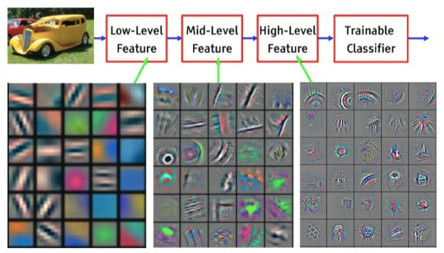
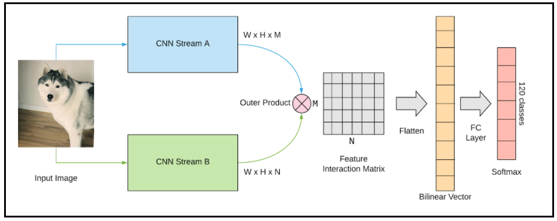
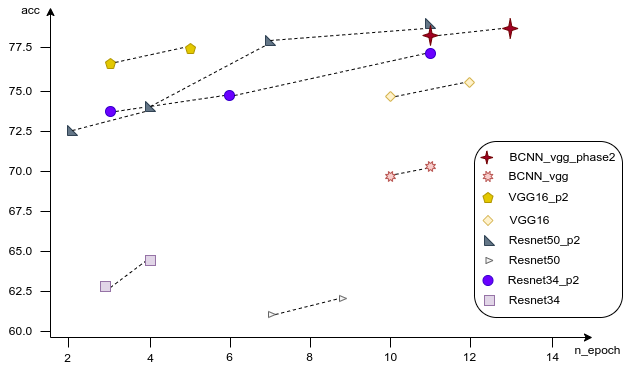

# fine-grained-image-classification

**Author notes:** All the experiment in this project are logged and stored at [Weight \& Biases](https://wandb.ai/nmd2000/fine-grained-classification). Report details is available at [Here](resource/report.pdf)

Table of Contents
- [Introduction](#introduction)
- [Related Works](#related-works)
- [Methodology](#methodology)
- [Experiments](#experiments)
- [Conclusion](#conclusion)
- [References](#references)

# Abstract 
Fine-grained image classification requires model to differentiate minor categories. The challenges with fine-grained task come from the relatively small visual different between classes, therefore, model can be influenced by many factors such as pose, light source, etc. Convolution Neural Network have been the standard solution for many Computer Vision task where category have strong visual difference. In this project, I proposed my assumption about the role of high layer in CNNs and the new transfer learning strategy traind on both CNNs and Bilinear CNNs model, which help me achieved 78.56% accuracy on FGVC testset.

# Introduction
“Fine-grained image classification” (FGIC) is an area of expertise in image recognition which requires machine to recognize the difference between fine-grained subordinate category of a super-category (e.g., different species of animals/plants, different models of cars, etc). In general, model is required to sufficiently discriminate between objects that are highly similar in overall appearance but turn out to be different classes.

Convolution neural networks (CNNs) has emerged as a standard method for discriminative feature learning [3]. Researcher’s directions have been split into 2 main ways: (i) *Recognition using localization-classification sub-networks* and *(ii) Recognition using end-to-end feature encoding* [3]. While the "localization-classification” models are able to capture the semantic parts of fine-grained object, I found End-to-end models to be more handy, computational friendly, easy to reproduce and most important is they can easily inherit the representation strength from the pre-trained weights on a large image classification dataset such as ImageNet. Moreover, I proposed a new training strategy for efficient transfer learning on task such FGIC and tested them on some simple or low accuracy models. 

My main works of this project can be summarized as:
- Re-implement and reproduce bilinear Convolution Neural Network from scratch.
- Fine-tune model with the proposed transfer learning strategy on Resnet, VGG, Inception, B-CNNs.

# Related Works
Various methodologies have been proposed to locate discriminating part then use them for classifier (i.e. sliding window combined with HOG or SIFT feature extractors).However, this architecture is trained in supervised manner and required labeling the parts which is expensive than just label the overall image. In other hand, CNNs model have been proven to be successful in visual classification tasks and fine-tuning can leverage knowledge that they learned to similar tasks to create an end-to-end solution. Especially, Transfer learning is very powerful when come to problems with limited data (like in FGIA) where dataset normally has a large number of class while each class contains very little samples.

According to [3], while transfer learning from pre-trained model improve performance for similar task and reduce computational cost for the model, our strategy to transfer pre-trained weight become ineffective. The standard strategy is choosing actions between transfer all layers except linear classification layer; initial learning rate and other hyperparemeters for all layers; freeze fine-tuning layers. Given higher layers in deep neural network are more specialized. I suspect the important of them while perform transfer learning. In this work, I’ll test my assumption by new transfer strategy with common CNN model (i.e. Residual Neural Network (ResNet), Visual Geometry Group (VGG), Inception V3) as single model and as backbone of Bilinear CNNs architecture.

# Methodology
**Dataset.** FGVC Aircraft is used for training and evaluation, which contains 100 different models of aircraft (i.e. Boeing 737-300, Boeing 737-400) with 100 samples per class, split into a train and test sets. I cropped the object and then resized the images into $512\times512$ before cropping the central $448\times448$ as input for models.

**Transfer Learning strategy/Training pipeline.** The standard transfer learning strategy is to transfer all layers except final classification, then search to find the best initial parameter/hyperparameter. Several studies [2] have shown that models perform better as we increase the number of transferred layers from pre-trained weights. Given that CNNs architecture is generalized even to unseen categories and their higher layers are specialized. However, a high-level feature like car tie, bird tail, etc is useful when classifying different category, I assume they are not necessary, low-level feature such as shape, color, etc is believed to be more helpful, especially when dealing with fine-grained task.

*Figure 1.* Visualization of ResNet model. Deeper layer represent higher level features.

Testing this assumption, I proposed a new strategy to boost the effectiveness of transfer learning with multiple training phases. Phase 1 is the standard strategy, pre-trained layers are fully transferred apart from the final classification layer which will be initialized and trained from scratch. In phases 2 to $n$, I unfreeze or re-initialize the $n$ last layers ($n$ layers count from backward exclude classification layer) and re-train them with trained weight from the previous phase.

**Models.** I’ll use pre-trained ImageNet models as independent models and as a backbone for Bilinear CNN architecture [1]. This model selection is done for a purpose: whether simple CNNs that work well on large inter-class variations tasks can compare to designed architecture on fine-grained tasks.

The Bilinear CNNs model presented in Figure 2. is combined from two CNNs streams and connected by outer products a feature map, which captures pairwise interaction between different features, then passed to a fully connected layer. With $f_a$, $f_b$ representing feature map from stream $A$ and $B$, the bilinear combination can be present as $F^T_a \times F_b$, then passed through a signed square root step $x' = sign(x)\times \sqrt{|x|}$ and $l2$ normalization before feed into a fully connected layer.

*Figure 2.* Bilinear CNNs architecture.

# Experiments
**Metrics.** The most common metric is used in fine-grained classification tasks is Top 1 accuracy across all categories. $Accuracy = |I_{correct}|/|I_{total}|$ where $I_{correct}$ is number of correctly predictions and $I_{total}$ is number of total samples.

*Figure 3:* Comparison between CNNs and Bilinear models based on accuracy and computational cost.

**Training.** I trained a simple fully connected CNNs and re-train with model after re-initialize $n$ last layer ($n$ is manual setup), I used optimial learning rate for FGVC dataset is $0.025$ [2] and batch size is set 32. The model will automatically stop after 3 non-increase validate loss. I performed serveral model, shown in Figure 3, and achieve 78.56\% Top-1 accuracy as best score. The training log and weights are saved in Weight \& Biases, see more detail in my Github.

# Conclusion
The figure 3 shows ResNet50 in phase 2 and VGG16 in phase 2 are the best model, which achieve 78.56\% and 78.1\% top 1 accuracy respectively. There are a significant improve in models from the first phase to later phase, where high layers have been re-initialized and ready to learn new feature. The result show models in late phase quickly out perform their best models in previous phase, even with little training epochs. Moreover, the improvement also appears in other models (B-CNNs, ResNet34) has prove my proposed transfer learning strategy to be efficient and the assumption of the necessary to re-train high layer for better fit the tasks. 

# References
[1] Tsung-Yu Lin, Aruni RoyChowdhury, and Subhransu Maji. Bilinear CNN models for fine-grained visual recognition. CoRR, abs/1504.07889, 2015.

[2] Jo Plested, Xuyang Shen, and Tom Gedeon. Non-binary deep transfer learning for imageclassification. CoRR, abs/2107.08585, 2021.

[3] Xiu-Shen Wei, Yi-Zhe Song, Oisin Mac Aodha, Jianxin Wu, Yuxin Peng, Jinhui Tang, Jian Yang, and Serge J. Belongie. Fine-grained image analysis with deep learning: A survey. CoRR, abs/2111.06119, 2021.